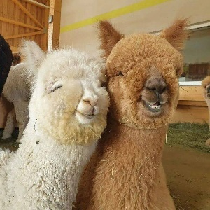

# Добров-Рыжов Никита Юрьевич

# 

**Работаю системным администратором** но в будущем планирую стать программистом!

Мне нравится работать в сфере IT， и вот что я умею:
1. Работать с операционной системой **GNU/LINUX**;
2. Работать с операционной системой **WINDOWS**;
3. Работать с операционной системой **MAC OS**.

Мое хобби:
1. *Авиация*;
2. *Мотоциклы*;
3. *Ну и конечно как же без моего любимого китайского языка* (老师我知道你看了在Google翻译) :)